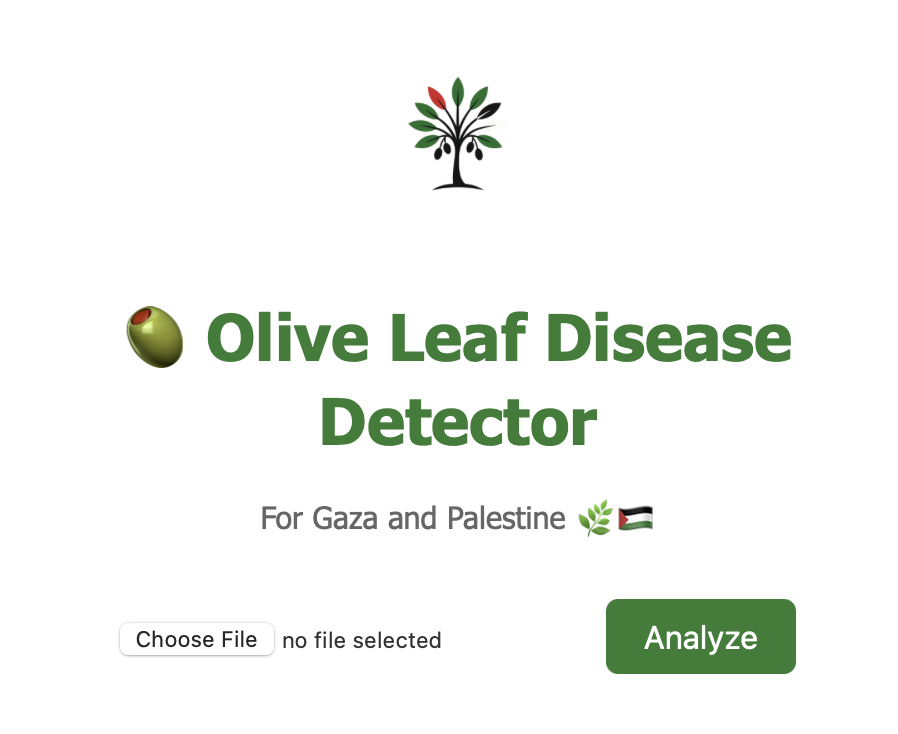

# 🇵🇸 Olive Leaf Disease Detector 🌿

A deep learning-based application to detect and classify olive leaf diseases using MobileNetV2 — built to support Palestinian agriculture and empower local farmers with accessible AI tools.


## ✨ Project Highlights

- ✅ Trained MobileNetV2 with custom head on 3 classes: healthy, peacock spot, aculus olearius
- 🎯 Achieved 91% test accuracy and 0.98 macro ROC-AUC
- 🌐 Flask web app for uploading olive leaf images and getting predictions
- 🌿 Localized interface

---

## 📂 Folder Structure
```plaintext

olive-disease-detector/
├── app/
│   ├── static/
│   │   ├── styles.css
│   │   ├── uploads/
│   │   └── palestine-olive-logo.png
│   ├── templates/
│   │   ├── index.html
│   │   └── result.html
│   └── app.py
│
├── data/
│   ├── train/
│   │   ├── aculus_olearius/
│   │   ├── healthy/
│   │   └── peacock_spot/
│   └── test/
│       ├── aculus_olearius/
│       ├── healthy/
│       └── peacock_spot/
│
├── notebooks/
│   ├── data-exploration.ipynb
│   └── model-training.ipynb
│
├── outputs/
│   ├── history/
│   │   └── history.pkl
│   ├── models/
│   │   └── olive_leaf_disease_model.h5
│   └── plots/
│       ├── class_distribution.png
│       ├── confusion_matrix.png
│       ├── feature_maps_top_conv.png
│       ├── misclassified_samples.png
│       ├── per_class_roc.png
│       ├── precision_recall_curves.png
│       └── training_curves.png
│
├── src/
│   ├── data_loader.py
│   ├── evaluate.py
│   ├── model_builder.py
│   ├── train.py
│   └── __init__.py
│
├── README.md
└── requirements.txt
```
## 🧠 Model Summary

- Backbone: MobileNetV2 (pretrained on ImageNet)
- Custom layers: GlobalAveragePooling + LeakyReLU + Dropout + BatchNorm
- Loss: Categorical Crossentropy
- Optimizer: Adam (1e-4)
- Data Augmentation: heavy rotation, zoom, flip, etc.
- Class weighting and partial under-sampling (peacock spot)

## 📊 Performance

| Metric         | Value   |
|----------------|---------|
| Test Accuracy  | ~91%    |
| ROC-AUC (macro)| 0.9841  |
| Precision      | > 0.87  |
| Recall         | > 0.90  |

🔍 Visuals are saved in /outputs/plots.

## 🚀 Run the Web App

First, clone the repository:

```bash
git clone https://github.com/HalaKhalifa/olive-disease-detector.git
cd olive-disease-detector
```

Install dependencies:

```bash
pip install -r requirements.txt
```

Run the app:
```bash
cd app
python app.py
```

Then open http://localhost:5000 in your browser.




Upload an olive leaf image to get real-time predictions like this:


---

## 📌 TODO / Future Work

- Mobile deployment (TFLite)
- Collect more diverse olive leaf datasets and include more olive diseases
- Real-time webcam inference
- Multi-language support (Arabic UI)
- Feedback system for farmers

🕊️ For Gaza and Palestine 🌿🇵🇸